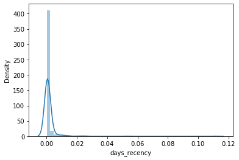
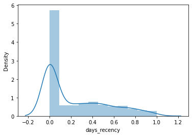
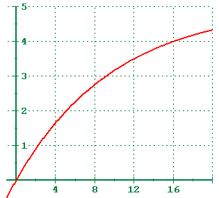

# Estimating adverse clinical outcomes and Biological Age using CT & Clinical Data

## Description

This code predicts adverse clinical outcomes using patient's CT and clinical data. We also attempt to predict a patient's biological age using his/her data.

## Methodology - Predicting Death, Diabetes and Heart Attack

For each 3 predictions, we first use only CT data, and then take the results again with CT + Clinical data. Our experiment involves running 3 algorithms, and comparing their corresponding RMSE (Root Mean Square Error)

1. Linear Regression
2. Support Vector Regressor
3. XGBoost

For each 3 predictions, we split the original dataset of size 9223 items in 80-20 train/test fashion. It includes both *NULL* and *NON-NULL* key columns. For example, for column *DEATH [d from CT]* we have

- Train Data - 7363, 6944 NULL, 419 NON-NULL
- Test Data - 1860, 1730 NULL, 130 NON-NULL

### Approach-1:

We don't perform any other modification or data pre-processing in this approach.

For each 3 predictions, we perform the following operations:

1. We train our model **only on NON-NULL training data** and test on NULL test data.
2. We compare the distribution of values computed in the previous step with that of the NON-NULL test data

### Approach-2: Recency

In this approach, we introduced a new column *recency*.

*death_recency = 1/DEATH[d_from_ CT]*
*diabetes_recency = 1/DX_Date[d_from_ CT]*
*heart_attack_recency = 1/MI_DX_Date[d_from_ CT]*

This gives us the chance to fill all NULL values with zeros. However, it results in skewed data shown in the Figure above. Hence, we transformed non-zero values (using Box-cox transform) to a more uniform distribution. Later, we sub-sampled zero samples to be equal to non-zero samples. This provides us with different training/test number of samples than the original. For example, for *death\_recency* we got 838 training samples and 1860 test samples.

For each 3 predictions, we perform the following operations:

1. We train our model on the **entire training data** and test on NULL test data.
2. We compare the distribution of values computed in the previous step with that of the NON-NULL test data

## Methodology - Deriving Biological Age

We split the dataset into train and test using *DEATH [d from CT]* column. The data item with non-empty value will go into training data, and the rest will be used to check the effectiveness of the methodology. Based on this, we split the original dataset of size 9223 into 549 training items and 8674 test items.

We made a few intuitive assumptions:

1. People die when they hit biological age 100. Healthy people can slow down the bio age, and that is how some humans live more than 100 chronological ages. This gives us *max\_bio\_age\_in\_days* = 36500
2. Higher the *DEATH[d from CT]*, higher the patient has *bio\_days\_left* to live

Based on this assumption, we define the biological age for training data as the function of *bio\_days\_left*.

*bio_age = max\_bio\_age\_in\_days - bio\_days\_left*

*bio\_age\_left = A + C*(1-exp -k*x )*

Here, *bio\_days\_left* follows an exponential decay function (increasing) form as shown in Fig - \ref{fig:exp_decay}

We calculate *bio\_days\_left* for training data, and then apply the following 2 algorithms:

1. Linear Regression
2. XGBoost

## Code Notebooks
* In order to predict no. of death days, run the notebook `Regression_Predicting_days.ipynb`
* In order to predict Recency, run the notebook `Regression_Predicting_recency.ipynb`
* For Biological Age estimation, run the notebook `bioage.ipynb`
